# Mirrorstoolkit: one-liner analysis tool

``` r
library(dplyr)
#> 
#> Attaching package: 'dplyr'
#> The following objects are masked from 'package:stats':
#> 
#>     filter, lag
#> The following objects are masked from 'package:base':
#> 
#>     intersect, setdiff, setequal, union
library(readxl)
library(mirrorstoolkit)
```

## Data Preparation

### Compute NIH equation 2 for LDL (calc) estimation

compute_nih_ldl functions allows either value or vectorized operation

#### By value

Simply input the value

``` r
mirrorstoolkit::compute_nih_ldl(tchol = 112.9,hdl = 39.9, trig = 151)
#> [1] 47.18626
```

#### Vectorized

Use the column name, it uses basic dplyr naming flow. If your column
name is not one character string surround it by “\`”

``` r
df = df %>% dplyr::mutate(
  `LDL (calc) mg/dL` = mirrorstoolkit::compute_nih_ldl(
    tchol = `Chol mg/dL`,
    hdl = `HDL mg/dL`,
    trig = `Trig mg/dL`))

df %>% 
  dplyr::select(
    tidyr::all_of(
      c("Chol mg/dL", 
        "HDL mg/dL",
        "Trig mg/dL", 
        "LDL (calc) mg/dL")
      )) %>% head()
#> # A tibble: 6 × 4
#>   `Chol mg/dL` `HDL mg/dL` `Trig mg/dL` `LDL (calc) mg/dL`
#>          <dbl>       <dbl>        <dbl>              <dbl>
#> 1         113.        39.9          151               47.2
#> 2         189.        76.5          146               87.8
#> 3          92         49.2           82               26.1
#> 4         153.        29.4          315               73.0
#> 5         134.        58.8           83               59.7
#> 6         105.        41.3          145               38.7
```

## Exploratory Data Analysis

### Single Group analysis

#### Normality Inspection

This is a part which I feel is not emphasized enough in our lab
practice - we need to determine if a lab evaluation or result result is
normally distributed. **inspect_distribution()** can give a basic
visualization about the distribution by

- The histogram
- The density plot
- [Shapiro-Wilk
  test](https://en.wikipedia.org/wiki/Shapiro%E2%80%93Wilk_test)
  result - please be aware that the null hypothesis is it’s normally
  distributed, thus if it is significant, it is not normal.

It usually gives a lot of warnings (depends on the completeness and
quality of your data for most of the times), I suppressed them here for
tidiness, but expose the warnings (omit the last function) are
recommended, it will give you useful informations.

Please always be aware that the normality it’s a very subjective
decision, always add a huge grab of your own salts from your reading and
experience, especially when you have a small sample size. See below,
from my perspective:

- Albumin, from PMID: 18405401, is generally normal overall.
- Calcium is quite normal, which is a bit out of my expectation.
- Smoking is actually boolean (binary, 0/1).
- LDL, it is on you, you can either treat it as normal or not normal, my
  experience is it’s generally normal.
- wIS often treated as normally distributed on my side.
- Lp(a), skewed right for sure

``` r
mirrorstoolkit::inspect_distribution(
  data = df, 
  variable = c(
    "Albumin", 
    "Calcium",
    "Smoking",
    "LDL (calc) mg/dL",
    "wIS",
    "Lp(a) (nmol/L)")
  ) %>% base::suppressWarnings()
#> $visualization
#> $`1`
```

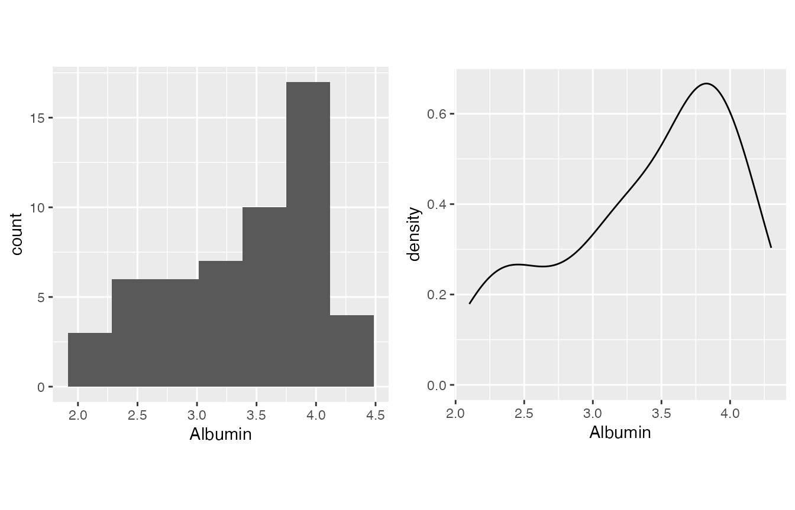

    #> 
    #> $`2`

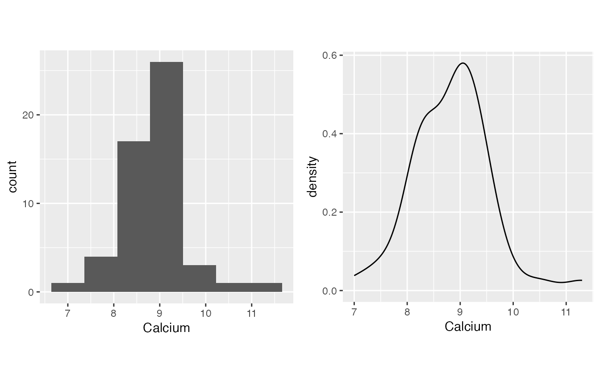

    #> 
    #> $`3`

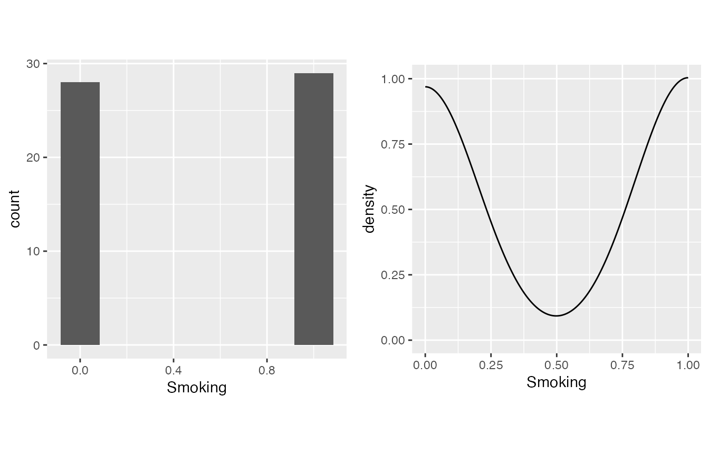

    #> 
    #> $`4`

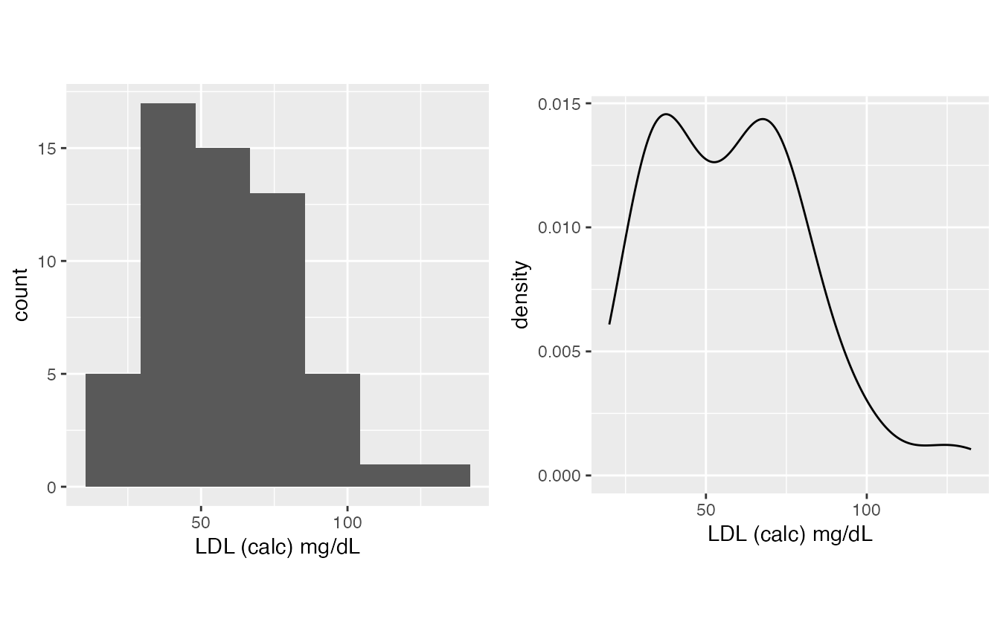

    #> 
    #> $`5`

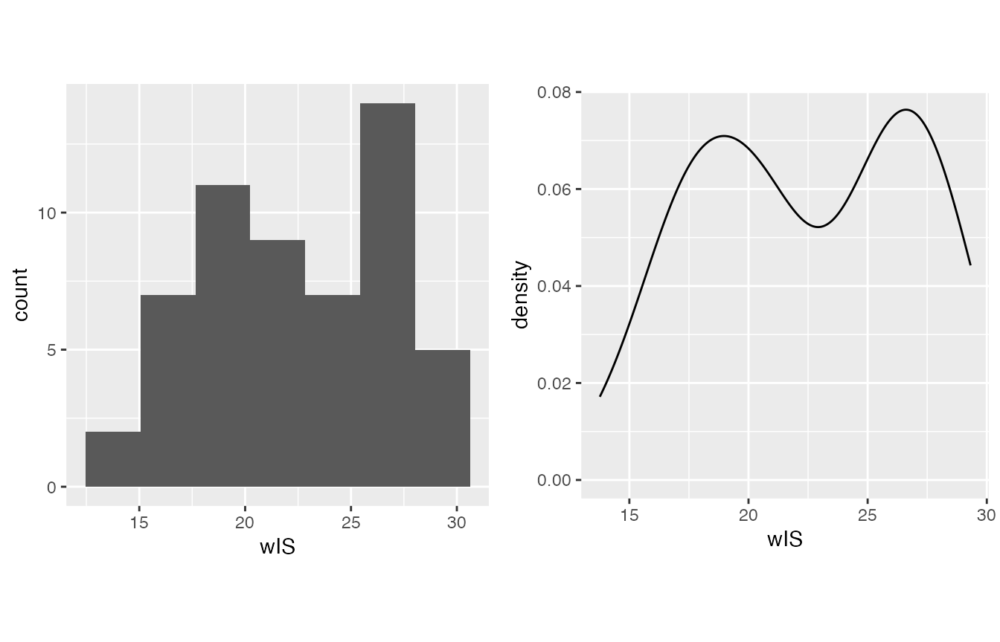

    #> 
    #> $`6`

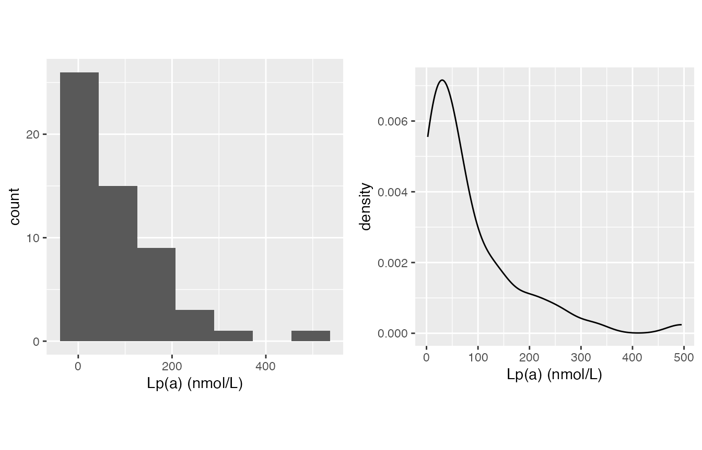

    #> 
    #> attr(,"class")
    #> [1] "list"      "ggarrange"
    #> 
    #> $`shapiro-wilk_test`
    #>           variable      p_value normality
    #> 1          Albumin 2.016173e-03     FALSE
    #> 2          Calcium 6.699764e-02      TRUE
    #> 3 LDL (calc) mg/dL 1.457113e-02     FALSE
    #> 4   Lp(a) (nmol/L) 5.255467e-08     FALSE
    #> 5          Smoking 1.278103e-10     FALSE
    #> 6              wIS 7.879851e-03     FALSE

#### Characteristic Table

With the result above, you can make your decision and generate a
characteristic table.

- Boolean (1/0) data should be in boolean_list, the ratio of 1 will be
  computed
- Normally distributed continuous data should be in sd_list, the
  mean(sd) will be computed
- Non-normally distributed continuous data should be in IQR_list, the
  median(IQR) will be computed

These three lists can be skipped if you don’t have one variable falls
into this category.

``` r
mirrorstoolkit::characteristic_table_generator(
  data = df,
  boolean_list = c("Smoking"),
  sd_list = c(
    "Calcium", 
    "wIS", 
    "LDL (calc) mg/dL",
    "Albumin"
    ),
  IQR_list = "Lp(a) (nmol/L)",
  order = c(
    "Smoking", 
    "Albumin",
    "Calcium", 
    "LDL (calc) mg/dL",
    "wIS",
    "Lp(a) (nmol/L)")
)
#>                              overall
#> Smoking                29/57(50.88%)
#> Albumin                   3.4 ± 0.63
#> Calcium                  8.83 ± 0.73
#> LDL (calc) mg/dL       58.34 ± 24.31
#> wIS                     22.46 ± 4.45
#> Lp(a) (nmol/L)   46.76(19.66-118.88)
```

Another implementation can be used here (although I prefer the one
above), I don’t know why R original output is not a table for
multi-column summary.

Please be aware that this one will run summary() for all columns
provided in this table.

``` r
mirrorstoolkit::multi_line_summary(
  df[,c(
    "Smoking", 
    "Albumin",
    "Calcium", 
    "LDL (calc) mg/dL",
    "wIS",
    "Lp(a) (nmol/L)")])
#> Warning in (function (..., deparse.level = 1) : number of rows of result is not
#> a multiple of vector length (arg 1)
#>                      Min.  1st Qu.   Median       Mean  3rd Qu.     Max.
#> Smoking           0.00000  0.00000  1.00000  0.5087719   1.0000   1.0000
#> Albumin           2.10000  3.00000  3.60000  3.3981132   3.9000   4.3000
#> Calcium           7.00000  8.30000  8.90000  8.8339623   9.3000  11.3000
#> LDL (calc) mg/dL 19.95264 36.36183 57.88097 58.3391133  72.3185 132.4144
#> wIS              13.76000 18.37000 21.80000 22.4583636  26.3950  29.3200
#> Lp(a) (nmol/L)    2.36000 19.65500 46.76000 82.5434545 118.8850 495.4500
#>                      NA's
#> Smoking           0.00000
#> Albumin           4.00000
#> Calcium           4.00000
#> LDL (calc) mg/dL 19.95264
#> wIS               2.00000
#> Lp(a) (nmol/L)    2.00000
```

### For two groups result

Most of our analysis is based on two groups, e.g. African American vs
Caucasians, Study vs control, etc.

#### Normality Inspection

Add a “by” variable will classify the data. However, I’d suggest keep
watching it overall for the distribution. This is simply for
completeness in quick inspection.

``` r
mirrorstoolkit::inspect_distribution(
  data = df, 
  by = "Race",
  variable = c(
    "Albumin", 
    "Calcium",
    "Smoking",
    "LDL (calc) mg/dL",
    "wIS",
    "Lp(a) (nmol/L)")
  ) %>% base::suppressWarnings()
#> $visualization
#> $`1`
```

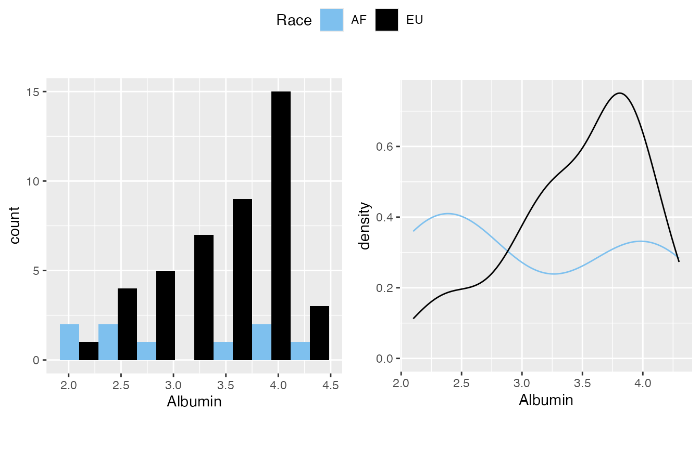

    #> 
    #> $`2`

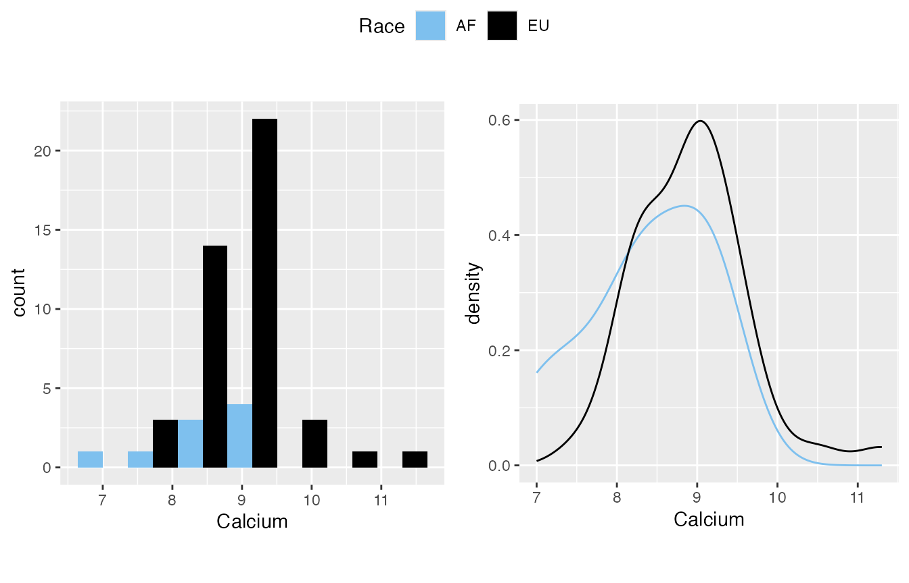

    #> 
    #> $`3`

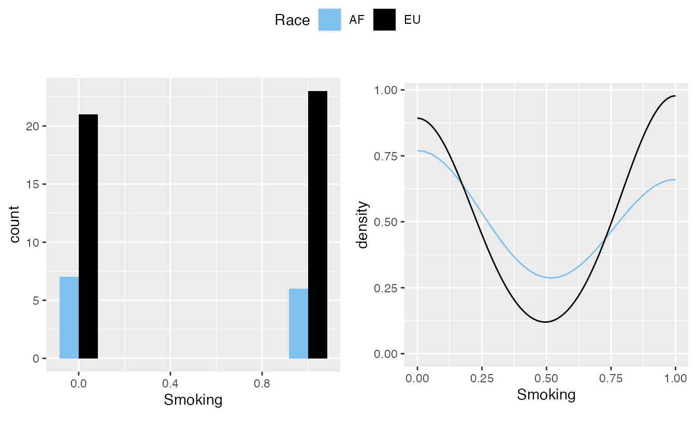

    #> 
    #> $`4`

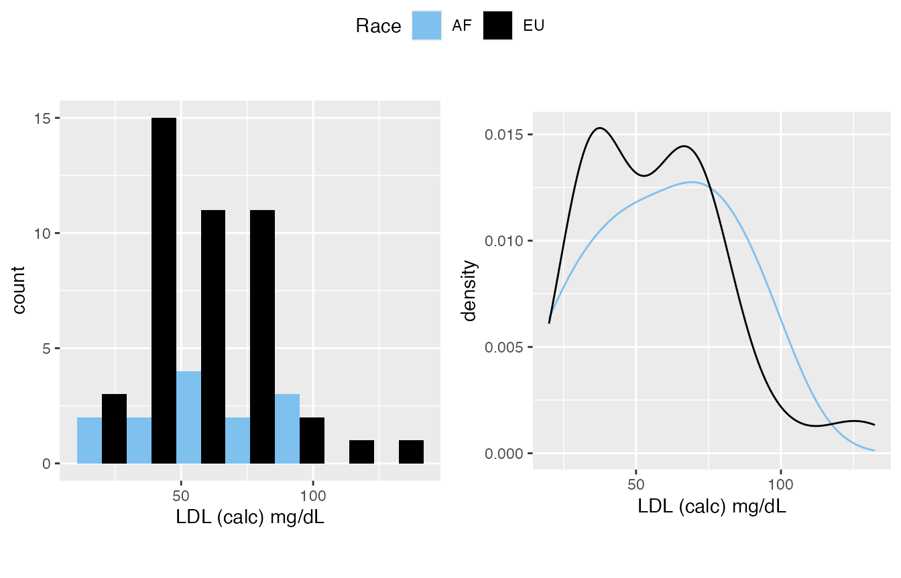

    #> 
    #> $`5`

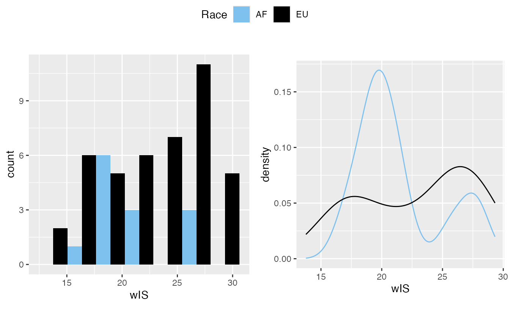

    #> 
    #> $`6`

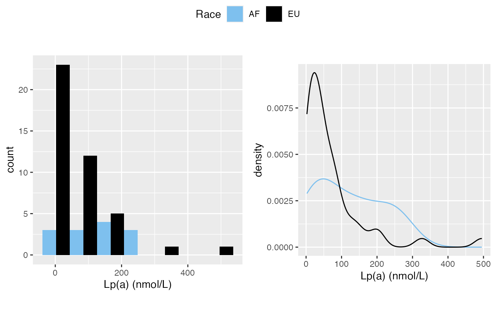

    #> 
    #> attr(,"class")
    #> [1] "list"      "ggarrange"
    #> 
    #> $`shapiro-wilk_test`
    #>           variable      p_value normality             AF             EU
    #> 1          Albumin 2.016173e-03     FALSE FALSE(3.3e-02) FALSE(1.9e-02)
    #> 2          Calcium 6.699764e-02      TRUE  TRUE(4.9e-01) FALSE(3.0e-02)
    #> 3 LDL (calc) mg/dL 1.457113e-02     FALSE  TRUE(9.2e-01) FALSE(3.6e-03)
    #> 4   Lp(a) (nmol/L) 5.255467e-08     FALSE  TRUE(1.9e-01) FALSE(1.7e-08)
    #> 5          Smoking 1.278103e-10     FALSE FALSE(1.7e-04) FALSE(3.4e-09)
    #> 6              wIS 7.879851e-03     FALSE FALSE(4.5e-02) FALSE(6.8e-03)

#### Characteristic Table

With a “by” provided, it will generate statistics for sub-class,
meanwhile a p_value column is provided.

- For variables in boolean_list, the p-value is from chi-square test
  (stats::chisq.test())
- For variables in IQR_list, the p-value is from Mann-Whitney U test
  (Wilcoxon rank-sum test, stats::wilcox.test())
- For varaibles in sd_list, the p-value is depending on variable
  *normal_policy*
  - if normal_policy is “wilcox”(*default*): it will run Mann-Whitney U
    test, for the following two reason:
    - Our normal data is often not “that normal”.
    - A sample size of 30 or more is often cited as a general guideline
      to ensure a normal distribution is a reasonable approximation.
  - if normal_policy is “t-test”: it will run [Welch’s
    t-test](https://en.wikipedia.org/wiki/Welch%27s_t-test)
    (stats::t.test(var.equal = FALSE)), which is a more reliable
    adaptation of Student’s t-test when the two samples have unequal
    variances and possibly unequal sample sizes

``` r
mirrorstoolkit::characteristic_table_generator(
  data = df,
  by = "Race",
  boolean_list = c("Smoking"),
  sd_list = c(
    "Calcium", 
    "wIS", 
    "LDL (calc) mg/dL",
    "Albumin"
    ),
  IQR_list = "Lp(a) (nmol/L)",
  order = c(
    "Smoking", 
    "Albumin",
    "Calcium", 
    "LDL (calc) mg/dL",
    "wIS",
    "Lp(a) (nmol/L)"),
  normal_policy = "t-test"
)
#>                              overall                   AF                 EU
#> Smoking                29/57(50.88%)         6/13(46.15%)      23/44(52.27%)
#> Albumin                   3.4 ± 0.63           3.1 ± 0.88        3.46 ± 0.56
#> Calcium                  8.83 ± 0.73          8.41 ± 0.79         8.92 ± 0.7
#> LDL (calc) mg/dL       58.34 ± 24.31        60.24 ± 24.85      57.78 ± 24.41
#> wIS                     22.46 ± 4.45         21.31 ± 3.52       22.81 ± 4.68
#> Lp(a) (nmol/L)   46.76(19.66-118.88) 127.64(46.92-197.37) 41.08(15.27-79.61)
#>                     p_value
#> Smoking          7.5912e-01
#> Albumin          2.6747e-01
#> Calcium          9.9941e-02
#> LDL (calc) mg/dL 7.5591e-01
#> wIS              2.2530e-01
#> Lp(a) (nmol/L)   4.8697e-02
```

### For 3+ groups result

#### Normality Inspection

Normality inspection is same as the 2 groups result

#### Characteristic Table

With a “by” provided, it will generate statistics for sub-class,
meanwhile a p_value column is provided.

- For variables in boolean_list, the p-value is from chi-square test
  (stats::chisq.test())
- For variables in IQR_list, the p-value is from Kruskal–Wallis test
  (stats::kruskal.test())
- For varaibles in sd_list, the p-value is depending on variable
  *normal_policy*
  - if normal_policy is “wilcox”(*default*, I inherited the name from
    above thus won’t make things too complex): it will run
    stats::kruskal.test(), for the following two reason:
    - Our normal data is often not “that normal”.
    - A sample size of 30 or more is often cited as a general guideline
      to ensure a normal distribution is a reasonable approximation.
  - if normal_policy is “t-test”: it will run ANOVA(stats::aov())

``` r
df = df %>% dplyr::mutate(
  Calciphylaxis_str = Calciphylaxis %>% plyr::mapvalues(c(0,1), c("control", "disease")),
  group = paste(`Race`, `Calciphylaxis_str`, sep = "_"))

df$group %>% table()
#> .
#> AF_control AF_disease EU_control EU_disease 
#>          8          5         22         22
```

``` r
table_1_by_group = mirrorstoolkit::characteristic_table_generator(
  data = df,
  by = "group",
  boolean_list = c("Smoking"),
  sd_list = c(
    "Calcium", 
    "wIS", 
    "LDL (calc) mg/dL",
    "Albumin"
    ),
  IQR_list = "Lp(a) (nmol/L)",
  order = c(
    "Smoking", 
    "Albumin",
    "Calcium", 
    "LDL (calc) mg/dL",
    "wIS",
    "Lp(a) (nmol/L)"),
  normal_policy = "t-test"
)
table_1_by_group
#>                              overall          AF_control          AF_disease
#> Smoking                29/57(50.88%)            4/8(50%)            2/5(40%)
#> Albumin                   3.4 ± 0.63         3.52 ± 0.83         2.76 ± 0.83
#> Calcium                  8.83 ± 0.73          8.7 ± 0.45         8.18 ± 0.97
#> LDL (calc) mg/dL       58.34 ± 24.31       64.04 ± 28.44       54.16 ± 19.04
#> wIS                     22.46 ± 4.45        22.22 ± 3.48         19.85 ± 3.4
#> Lp(a) (nmol/L)   46.76(19.66-118.88) 137.46(43.7-206.76) 55.59(51.67-129.45)
#>                          EU_control        EU_disease    p_value
#> Smoking               12/22(54.55%)        11/22(50%) 9.8051e-01
#> Albumin                  3.82 ± 0.3        3.1 ± 0.54 2.8352e-05
#> Calcium                 8.79 ± 0.54       9.05 ± 0.82 1.0060e-01
#> LDL (calc) mg/dL      56.18 ± 17.64     59.38 ± 30.07 8.5607e-01
#> wIS                    22.98 ± 4.51      22.65 ± 4.96 5.7002e-01
#> Lp(a) (nmol/L)   33.85(18.76-87.43) 43.4(14.11-75.14) 2.0291e-01
```

The output illutrated the p-value as literal string for I need to keep
the format for paper use… To filter the p-value you can do this

``` r
table_1_by_group %>% 
  dplyr::mutate(p_value = p_value %>% as.numeric()) %>% 
  dplyr::filter(p_value < 0.05)
#>            overall  AF_control  AF_disease EU_control EU_disease    p_value
#> Albumin 3.4 ± 0.63 3.52 ± 0.83 2.76 ± 0.83 3.82 ± 0.3 3.1 ± 0.54 2.8352e-05
```

#### Pairwise test

Please always be aware that for 3+ group test, one p-value is not
sufficient to claim too much stuff. Multi-class
chi-square/Kruskal-Wallis/ANOVA only told you “some group is different
from the other”

##### Boolean Variables

Pairwise comparisons between pairs of proportions
(stats::pairwise.prop.test) used here, a filled barchart used in the
visualization.

When the pairwise test is throwing “Warning: Chi-squared approximation
may be incorrect” means that one or more of your table’s expected cell
counts are too small for the Chi-squared test to be reliable, typically
when they are less than 5. This violates the test’s assumptions, and you
should address it by either increasing sample size, combining
categories, or using an alternative like Fisher’s exact test or a
simulated p-value.

- If it’s labelled significant, it can be a good support to your claim.
- If it’s not labelled as significant, it doesn’t always mean that they
  are not different, it’s simply stats::pairwise.prop.test cannot handle
  it. Be bold to make your choice.

Some settings, I grabbed a setting from the air for the illustration:

- *adjustment_method* The choice of this variable is from
  [here](https://www.rdocumentation.org/packages/stats/versions/3.6.2/topics/p.adjust).
  “fdr” (Benjamini-Hochberg FDR correction) by default thus you can
  often skip it.
- *p_threshold* will affect the filtering from first to second table,
  the significant result will be labelled on the top of the figure, 0.05
  by default
- *variable* can take one or more variables.

``` r
pairwise_boolean = mirrorstoolkit::pairwise_boolean_report(
  data = df, 
  variable = c("antiplatelet_group", "statin_group"), 
  by = "group",
  adjustment_method = "none",
  p_threshold = 0.3)
#> Warning in prop.test(x[c(i, j)], n[c(i, j)], ...): Chi-squared approximation
#> may be incorrect
#> Warning in prop.test(x[c(i, j)], n[c(i, j)], ...): Chi-squared approximation
#> may be incorrect
#> Warning in prop.test(x[c(i, j)], n[c(i, j)], ...): Chi-squared approximation
#> may be incorrect
#> Warning in prop.test(x[c(i, j)], n[c(i, j)], ...): Chi-squared approximation
#> may be incorrect
#> Warning in prop.test(x[c(i, j)], n[c(i, j)], ...): Chi-squared approximation
#> may be incorrect
#> Warning in prop.test(x[c(i, j)], n[c(i, j)], ...): Chi-squared approximation
#> may be incorrect
#> Warning in prop.test(x[c(i, j)], n[c(i, j)], ...): Chi-squared approximation
#> may be incorrect
#> Warning in prop.test(x[c(i, j)], n[c(i, j)], ...): Chi-squared approximation
#> may be incorrect
#> Warning in prop.test(x[c(i, j)], n[c(i, j)], ...): Chi-squared approximation
#> may be incorrect
#> Warning in prop.test(x[c(i, j)], n[c(i, j)], ...): Chi-squared approximation
#> may be incorrect
#> Warning in ggsignif::geom_signif(data = annotation_significant,
#> ggplot2::aes(xmin = group1, : Ignoring unknown aesthetics: xmin,
#> xmax, annotations, and y_position
```

``` r
pairwise_boolean$result
#> # A tibble: 12 × 4
#>    variable_name      group1     group2     p_value
#>    <chr>              <chr>      <chr>        <dbl>
#>  1 antiplatelet_group AF_disease AF_control   0.396
#>  2 antiplatelet_group EU_control AF_control   1.00 
#>  3 antiplatelet_group EU_control AF_disease   0.357
#>  4 antiplatelet_group EU_disease AF_control   1    
#>  5 antiplatelet_group EU_disease AF_disease   0.281
#>  6 antiplatelet_group EU_disease EU_control   0.931
#>  7 statin_group       AF_disease AF_control   1    
#>  8 statin_group       EU_control AF_control   1    
#>  9 statin_group       EU_control AF_disease   1    
#> 10 statin_group       EU_disease AF_control   0.907
#> 11 statin_group       EU_disease AF_disease   1    
#> 12 statin_group       EU_disease EU_control   0.803
```

``` r
pairwise_boolean$significant_result
#> # A tibble: 1 × 4
#>   variable_name      group1     group2     p_value
#>   <chr>              <chr>      <chr>        <dbl>
#> 1 antiplatelet_group EU_disease AF_disease    0.28
```

``` r
pairwise_boolean$plot
```

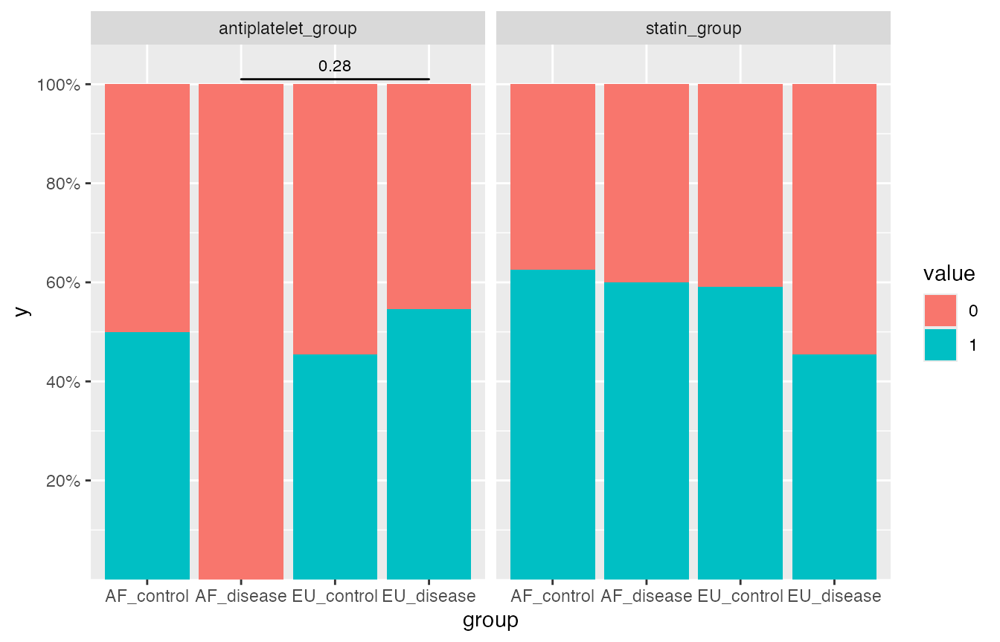

##### Not Normally Distributed Continuous Variables

Pairwise Mann-Whiteney U-test (stats::pairwise.wilcox.test) used here,
boxplot for illustration.

If you are not confident with the normality or the sample size, use this
one.

Please be aware of a toxic chemical reaction here:

- Mann-Whiteney U test is based on the rank of the sample
- Boxplot can drop some outliers out.

Thus this report is very visually misleading with extremely small sample
size, e.g. AF_disease group only have 5 samples and 1 outliers makes it
not significantly different from the other

``` r
df$`Lp(a) (nmol/L)`
#>  [1] 204.60   7.77  30.60     NA  18.76  86.02  33.85   6.33  31.30  33.85
#> [11]  38.89  58.27   9.88  29.37 252.60  34.02  10.87  46.92 147.29 127.64
#> [21] 234.93  13.59 197.37  87.43 495.45   3.97 125.88 156.62  74.34 195.71
#> [31]  20.55  78.89  43.26  75.14 129.45   3.37  55.59   4.65   8.23  79.85
#> [41] 111.89  43.40  46.76  51.67  33.39   4.65  20.83  44.61  14.11  55.33
#> [51] 326.37  74.65   2.36 273.65     NA 139.47   3.65
```

``` r
pairwise_wilcox = mirrorstoolkit::pairwise_wilcox_report(
  data = df, 
  variable = "Lp(a) (nmol/L)", 
  by = "group",
  p_threshold = 0.30
)
#> Warning in ggsignif::geom_signif(data = annotation_significant,
#> ggplot2::aes(xmin = group1, : Ignoring unknown aesthetics: xmin,
#> xmax, annotations, and y_position
```

``` r
pairwise_wilcox$result
#> # A tibble: 6 × 4
#>   variable_name  group1     group2     p_value
#>   <chr>          <chr>      <chr>        <dbl>
#> 1 Lp(a) (nmol/L) AF_disease AF_control   0.826
#> 2 Lp(a) (nmol/L) EU_control AF_control   0.250
#> 3 Lp(a) (nmol/L) EU_control AF_disease   0.738
#> 4 Lp(a) (nmol/L) EU_disease AF_control   0.250
#> 5 Lp(a) (nmol/L) EU_disease AF_disease   0.738
#> 6 Lp(a) (nmol/L) EU_disease EU_control   0.738
```

``` r
pairwise_wilcox$significant_result
#> # A tibble: 2 × 4
#>   variable_name  group1     group2     p_value
#>   <chr>          <chr>      <chr>        <dbl>
#> 1 Lp(a) (nmol/L) EU_control AF_control    0.25
#> 2 Lp(a) (nmol/L) EU_disease AF_control    0.25
```

``` r
pairwise_wilcox$plot
#> Warning: Removed 2 rows containing non-finite outside the scale range
#> (`stat_boxplot()`).
```

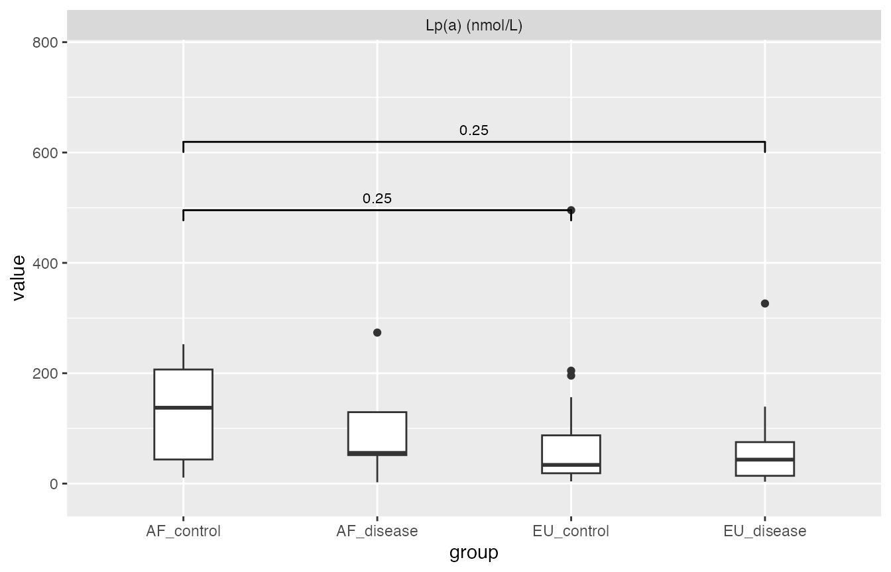

##### Normally Distributed Continuous Variables

Pairwise t-test (stats::pairwise.t.test) used here, barchart for mean
with errorbar (1 sd, not 95% CI) for illustration.

Still, if you are not confident with the normality or the sample size,
use the one for not normally distributed variable above.

``` r
pairwise_t_test = mirrorstoolkit::pairwise_t_test_report(
  data = df, 
  variable = c("Calcium","Albumin"), 
  by = "group",
  p_threshold = 0.15
)
#> Warning in ggsignif::geom_signif(data = annotation_significant,
#> ggplot2::aes(xmin = group1, : Ignoring unknown aesthetics: xmin,
#> xmax, annotations, and y_position
```

``` r
pairwise_t_test$result
#> # A tibble: 12 × 4
#>    variable_name group1     group2      p_value
#>    <chr>         <chr>      <chr>         <dbl>
#>  1 Albumin       AF_disease AF_control 0.0617  
#>  2 Albumin       EU_control AF_control 0.298   
#>  3 Albumin       EU_control AF_disease 0.000379
#>  4 Albumin       EU_disease AF_control 0.201   
#>  5 Albumin       EU_disease AF_disease 0.225   
#>  6 Albumin       EU_disease EU_control 0.000156
#>  7 Calcium       AF_disease AF_control 0.416   
#>  8 Calcium       EU_control AF_control 0.814   
#>  9 Calcium       EU_control AF_disease 0.261   
#> 10 Calcium       EU_disease AF_control 0.439   
#> 11 Calcium       EU_disease AF_disease 0.0977  
#> 12 Calcium       EU_disease EU_control 0.416
```

``` r
pairwise_t_test$significant_result
#> # A tibble: 4 × 4
#>   variable_name group1     group2     p_value
#>   <chr>         <chr>      <chr>        <dbl>
#> 1 Albumin       AF_disease AF_control 0.062  
#> 2 Albumin       EU_control AF_disease 0.00038
#> 3 Albumin       EU_disease EU_control 0.00016
#> 4 Calcium       EU_disease AF_disease 0.098
```

``` r
pairwise_t_test$plot
```

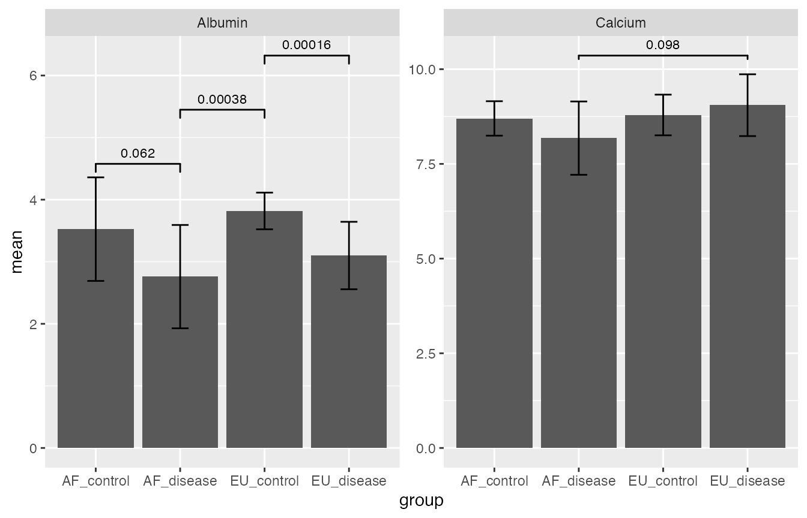

If you only want the first table in supplemental data, you can run the
one below as well. Replace “report” to “table” in the function name and
remove the p_threshold if you have. This function is internally called
in mirrorstoolkit::pairwise_t\_test_report, so do the other two.

``` r
mirrorstoolkit::pairwise_t_test_table(
  data = df, 
  variable = "Calcium", 
  by = "group"
)
#> # A tibble: 6 × 4
#>   variable_name group1     group2     p_value
#>   <chr>         <chr>      <chr>        <dbl>
#> 1 Calcium       AF_disease AF_control  0.416 
#> 2 Calcium       EU_control AF_control  0.814 
#> 3 Calcium       EU_control AF_disease  0.261 
#> 4 Calcium       EU_disease AF_control  0.439 
#> 5 Calcium       EU_disease AF_disease  0.0977
#> 6 Calcium       EU_disease EU_control  0.416
```

### Correlation matrix

We provide two functions for correlation matrix analysis.

#### To visualize the correlation matrix

mirrorstoolkit::correlation_matrix_plot will return a ggplot2 instance,
sharing a similar argument setting:

- variable is optional, if not provided, will use all the columns
  provided in data. However, as a fool-proofing operation, providing the
  variable column is a good sanity check as the function will internally
  enforces all the value in your data table to numeric.
- font_size is 5 by default for all labels.
- please be aware that the order is reordered by hierarchical clustering
  for better cluster illustration

``` r
mirrorstoolkit::correlation_matrix_plot(
  data = df,
  variable = c("BMI", "Albumin", "Calcium", "CRP", "apoB (nmol/L)","%Lp(a)-ApoB100"),
  font_size = 8
)
#> Warning: `aes_string()` was deprecated in ggplot2 3.0.0.
#> ℹ Please use tidy evaluation idioms with `aes()`.
#> ℹ See also `vignette("ggplot2-in-packages")` for more information.
#> ℹ The deprecated feature was likely used in the ggcorrplot package.
#>   Please report the issue at <https://github.com/kassambara/ggcorrplot/issues>.
#> This warning is displayed once per session.
#> Call `lifecycle::last_lifecycle_warnings()` to see where this warning was
#> generated.
```

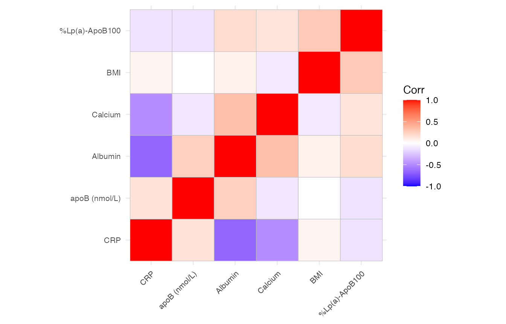

This function also provide a filter operation by the p-value as long as
the p_threshold is specified. see below (I changed the way inputting
column here for illustration purpose, it doesn’t matter):

``` r
mirrorstoolkit::correlation_matrix_plot(
  data = df %>% dplyr::select(
    tidyr::all_of(c("BMI", "Albumin", "Calcium", "CRP", "apoB (nmol/L)","%Lp(a)-ApoB100"))
    ),
  font_size = 8,
  p_threshold = 0.05
)
```

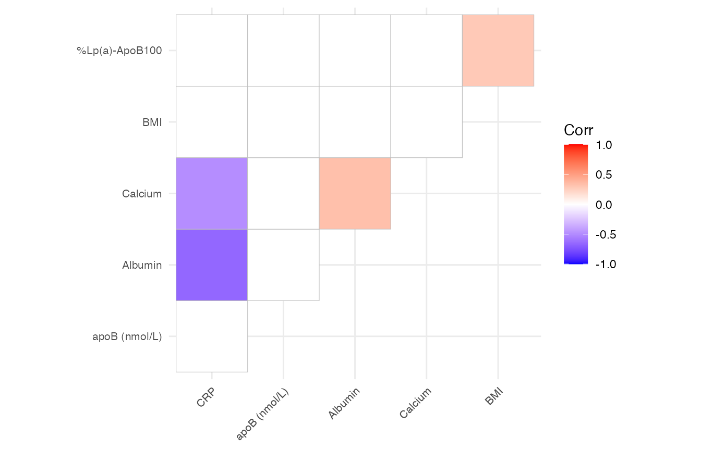

#### To further deal with the correlation matrix

For potential multi-omics studies in the future, I left an function here
outputting the matrix as data.frame format, which removed all the
redundant columns. It has a p_threshold option same as above but I don’t
think it’s necessary here.

``` r
mirrorstoolkit::correlation_matrix_dataframe(
  data = df,
  variable = c("BMI", "Albumin", "Calcium", "CRP", "apoB (nmol/L)","%Lp(a)-ApoB100")
)
#>              row         column        corr      p_value
#> 1            BMI        Albumin  0.07246750 6.096735e-01
#> 2            BMI        Calcium -0.09116465 5.203815e-01
#> 3        Albumin        Calcium  0.33290055 1.486389e-02
#> 4            BMI            CRP  0.06434398 7.309315e-01
#> 5        Albumin            CRP -0.66165518 3.729085e-05
#> 6        Calcium            CRP -0.48625030 4.776512e-03
#> 7            BMI  apoB (nmol/L) -0.00519316 9.696990e-01
#> 8        Albumin  apoB (nmol/L)  0.25441832 6.600239e-02
#> 9        Calcium  apoB (nmol/L) -0.10436060 4.570736e-01
#> 10           CRP  apoB (nmol/L)  0.15435436 3.989530e-01
#> 11           BMI %Lp(a)-ApoB100  0.27960245 4.059818e-02
#> 12       Albumin %Lp(a)-ApoB100  0.17946329 2.076293e-01
#> 13       Calcium %Lp(a)-ApoB100  0.14327436 3.158588e-01
#> 14           CRP %Lp(a)-ApoB100 -0.11916085 5.231636e-01
#> 15 apoB (nmol/L) %Lp(a)-ApoB100 -0.12428106 3.659771e-01
```

### Composition Component Trends

For the illustration of trends of a composition with a set of components

``` r
lipidomic_samples %>% head(3)
#>        WES_ID Lp(a) (nmol/L) DG 30:0/14:0 DG 30:1/14:0 DG 32:0/16:0
#> 1 washei26416          157.0 0.0008071535 0.0001372855  0.003098725
#> 2 washei27458           37.1 0.0009333268 0.0002105400  0.004237114
#> 3 washei28197           15.0 0.0032868436 0.0010452749  0.013764988
#>   DG 32:1/16:0 DG 32:2/16:1 DG 34:0/16:0 DG 34:1/16:0 DG 34:2/16:0 DG 34:2/16:1
#> 1 0.0006956733 0.0002478549  0.001698103  0.004516096 0.0013578084  0.001842253
#> 2 0.0007368318 0.0007199269  0.002174789  0.002236245 0.0005861636  0.001207711
#> 3 0.0036933192 0.0031672078  0.005407289  0.004072219 0.0021591445  0.003816118
#>   DG 36:0/18:0 DG 36:1/18:0 DG 36:2/18:0 DG 36:2/18:1 DG 36:3/18:1 DG 36:4/18:0
#> 1  0.001415583  0.003683802 0.0007110398  0.009479445 0.0020066608 9.143163e-06
#> 2  0.004551087  0.002515179 0.0005592532  0.005935862 0.0009731812 2.037506e-05
#> 3  0.009499735  0.005311344 0.0016281908  0.012059293 0.0022217465 0.000000e+00
#>   DG 38:1/18:0 DG 38:2/18:0 DG 38:2/18:1 DG 38:3/18:0 DG 38:3/18:1 DG 38:4/18:0
#> 1 0.0001244584 0.0025175506 0.0009816070 0.0007872274 0.0019228689 4.408206e-05
#> 2 0.0000000000 0.0010531250 0.0011219876 0.0013524833 0.0004459673 4.037663e-05
#> 3 0.0002654990 0.0006729207 0.0008393582 0.0053460809 0.0004614999 1.576657e-04
#>   DG 38:4/18:1 DG 40:4/18:0 DG 40:4/18:1 DG 40:5/18:0 DG 40:5/18:1 DG 40:6/18:0
#> 1 0.0003366250 1.112712e-05 1.190158e-05 4.217323e-05 1.682002e-05 9.500192e-05
#> 2 0.0003986452 2.709289e-05 1.349291e-05 5.475041e-06 1.950699e-05 1.778880e-04
#> 3 0.0018140866 8.260741e-05 9.626816e-05 2.173361e-04 6.999751e-05 5.937550e-04
#>   DG 40:6/18:1
#> 1 7.053647e-05
#> 2 5.693585e-05
#> 3 1.035781e-04
```

You can either specify the column you want by variable = c(“col1”,
“col2”, “col3”) if you need, but most of the times it will be quite
lengthy. If it is not specified, it will use all the columns not
mentioned in the table.

``` r
mirrorstoolkit::trend_bar_chart(
  data = lipidomic_samples,
  id = "WES_ID",
  by = "Lp(a) (nmol/L)",
  legend_title = "DG"
)
```

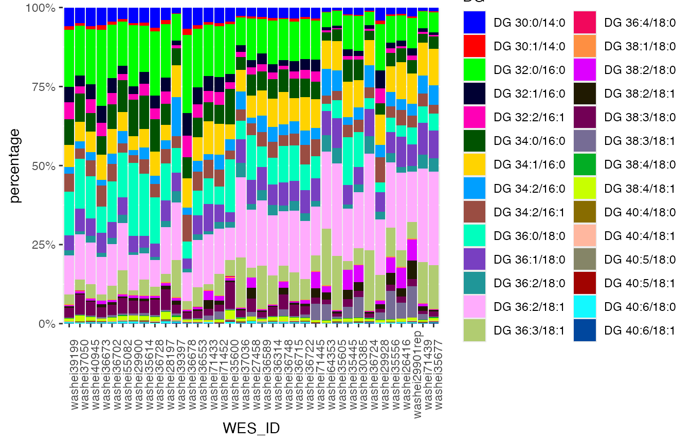

## Association Studies

For those you are interested, you might want to log them if you think
they are not normally distributed:

``` r
df = df %>% dplyr::mutate(
  LDL = `LDL (calc) mg/dL`,
  lpa_logged = `Lp(a) (nmol/L)` %>% base::log2(),
)
```

OLS_wrapper and logistic_wrapper() can deal with most of the association
analysis we need. In most of our tasks, we can specify the follow 2 or 3
lists as global settings used repetitively.

``` r
# The adjustment variable you need
adjustments = c(
  "Age", 
  "Gender", 
  "AF", 
  "BMI",
  "Smoking",
  "antiplatelet_group", 
  "anticoagulant_group", 
  "statin_group"
  )
# The variable you are interested in
variable_list = c(
  "Albumin",
  "Calcium",
  "LDL",
  "wIS", 
  "lpa_logged")
# In case the column name is not what you want in the output 
variable_list_formal = c(
  "Albumin",
  "Calcium",
  "LDL(calc) mg/dL",
  "wIS",
  "Lp(a) nmol/L, 2-logged"
  )
```

### Logistics regression

The wrapper is runing in the following way:

- For each column name mentioned in *variable_list*, let’s call it
  *variable_i*
  - Grab the columns mentioned in *variable_i*, *adjustments*, and
    *response* from *data*. If *variable_i* is in *adjustments*, will
    remove the duplicates
  - Logistic regression *response* $\sim$*variable_i* + *adjustment* + 1
  - Seek the effect size and coefficient of *variable_i*, compute the
    odd ratio by exp(effect size)
- Collect all the data

What you need to specify is:

- data, your dataframe
- response, which the column name of your target (y)
- adjustments, you adjustment list defined above
- by, if you want to categorize the data
- variable_of_interest, your variable list
- variable_of_interest_formal_name, the variable name list in the data

``` r
mirrorstoolkit::logistic_wrapper(
  data = df, 
  response = "Calciphylaxis",
  adjustments = adjustments,
  variable_of_interest = variable_list,
  variable_of_interest_formal_name = variable_list_formal
  )
#>                         Effect Size   Odd Ratio    P-value
#> Albumin                -5.170826684 0.005679871 0.00327561
#> Calcium                 0.833885757 2.302247357 0.11224877
#> LDL(calc) mg/dL         0.006642994 1.006665108 0.61218217
#> wIS                     0.003948747 1.003956554 0.95723792
#> Lp(a) nmol/L, 2-logged  0.014135081 1.014235454 0.94323132
```

### Ordinary Linear Regression

The setting is similar, let’s generate a continuous target variable:

``` r
df_disease =df %>% 
  dplyr::filter(Calciphylaxis == 1) %>% 
  dplyr::mutate(
    duration_before_diagnosis = (Calciphylaxis_diagnosis_date - HD_start_date) %>%
      lubridate::as.duration()/ lubridate::dmonths(1),
    duration_before_diagnosis = pmax(duration_before_diagnosis,0))
df_disease$duration_before_diagnosis
#>  [1] 78.7186858 47.6714579 92.9117043 39.3593429  0.0000000  2.2340862
#>  [7] 23.7535934  3.9425051 26.0205339  2.9240246 23.1950719  2.9568789
#> [13] 28.3860370  0.7227926 65.5770021  9.3963039  3.7453799 83.8439425
#> [19] 27.2032854  0.0000000 24.7392197 12.4517454 10.8418891 28.4517454
#> [25]  1.9712526 50.9240246  0.9527721
```

I called it OLS because machine learning community call it so… Forgive
me. Ordinary linear regression doesn’t have OR defined thus only beta
and p-value here.

``` r
mirrorstoolkit::OLS_wrapper(
  data = df_disease,
  response = "duration_before_diagnosis",
  adjustments = adjustments,
  variable_of_interest = variable_list,
  variable_of_interest_formal_name = variable_list_formal
)
#>                        Effect Size     P-value
#> Albumin                 9.38512237 0.419285024
#> Calcium                23.95816412 0.004014825
#> LDL(calc) mg/dL         0.08337316 0.749217682
#> wIS                    -1.01676960 0.442564703
#> Lp(a) nmol/L, 2-logged  0.51243742 0.906371748
```

## Summarize association studies

### Manhattan Plot

A quick Manhattan plot API is provided. A minimal data input can be the
following

``` r
association_result %>% head(3)
#> # A tibble: 3 × 4
#>   SNP        pos phenotype    `FDR_adjusted_p-value`
#>   <chr>    <dbl> <chr>                         <dbl>
#> 1 412-C/T    412 Glucose                      0.0220
#> 2 4785-C/A  4785 Hypertension                 0.0316
#> 3 387-G/C    387 Hypertension                 0.0316
```

Simply provide the column names to the API.

- pos: the position of SNV
- phenotype: the phenotype it links to
- p_value: the p_value of the association
- formal_name: give name to each SNV
- phenotype_list: the list of phenotype you want to work on.
- p_value_threshold: default 0.05, which will affect the significance
  level (red horizontal line), all points above this line should be
  labelled unless there are too many overlapping

``` r
mirrorstoolkit::manhattan_plot(
  data = association_result,
  pos = "pos",
  phenotype = "phenotype",
  p_value = "FDR_adjusted_p-value",
  formal_name = "SNP",
  phenotype_list = c("Hypertension", "HDL", "Glucose")
)
```

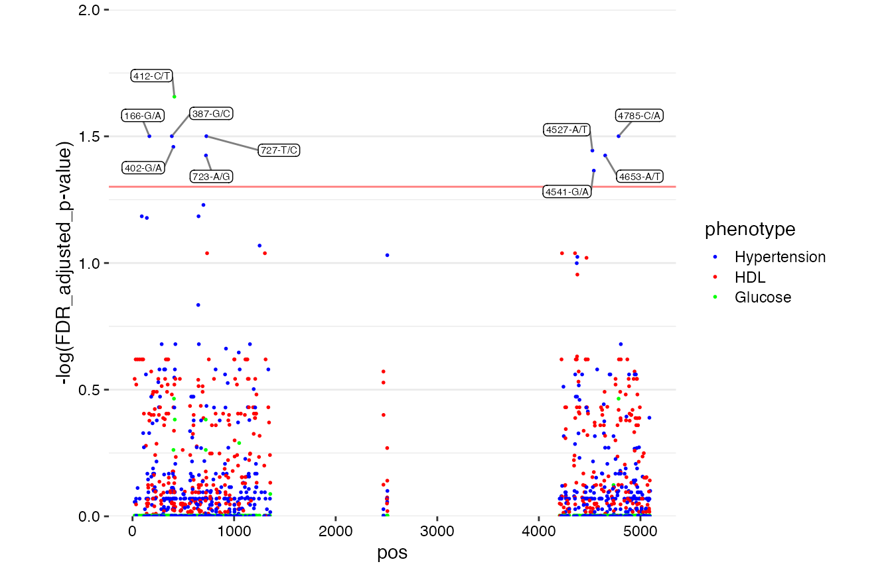 It’s also
okay for single phenotype, with another p-value threshold

``` r
mirrorstoolkit::manhattan_plot(
  data = association_result,
  pos = "pos",
  phenotype = "phenotype",
  p_value = "FDR_adjusted_p-value",
  formal_name = "SNP",
  phenotype_list = "Hypertension",
  p_value_threshold = 0.10
)
```

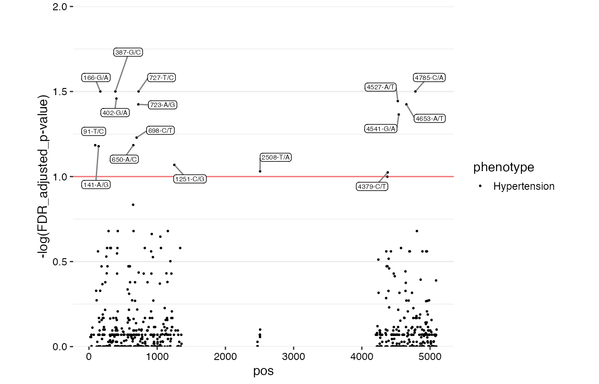

### Directed Acyclic Graph for multi-omics data

For data like these…

``` r
multi_omics_association_result %>% head(5)
#> # A tibble: 5 × 6
#>   from     to     beta `FDR_adjusted_p-value` from_type    to_type  
#>   <chr>    <chr> <dbl>                  <dbl> <chr>        <chr>    
#> 1 4894-G/A lpa    1.36                 0.0211 genotype_SNP phenotype
#> 2 620-A/G  lpa    1.43                 0.0211 genotype_SNP phenotype
#> 3 621-T/A  lpa    1.43                 0.0211 genotype_SNP phenotype
#> 4 4922-C/G lpa    1.49                 0.0211 genotype_SNP phenotype
#> 5 4970-T/A lpa    1.35                 0.0211 genotype_SNP phenotype
```

You can quickly generate these by networkX, it can be saved as an
interactive html files if you need.

``` r
dag = mirrorstoolkit::multi_omics_directed_acyclic_graph(
  data = multi_omics_association_result,
  from = "from",
  to = "to",
  beta = "beta",
  p_value = "FDR_adjusted_p-value",
  from_class = "from_type",
  to_class = "to_type"
)
```

``` r
dag$illustration_network
```

### Visualization of restricted cubic spline model

``` r
head(df)
#>     factor1      factor2      age      bmi sex
#> 1 1.0685479  0.680923388 57.94493 20.83511   0
#> 2 0.9717651  1.013496371 58.20817 25.20727   0
#> 3 1.0181564 -0.009105223 53.33630 26.60876   0
#> 4 1.0316431  0.560053416 52.09588 29.94023   0
#> 5 1.0202134 -1.478541110 55.37792 30.23393   1
#> 6 0.9946938  0.952096837 51.99340 19.04435   1
head(y)
#> [1] 1 0 0 1 0 1
```

``` r
dd = rms::datadist(df)
lrm_fit <- rms::lrm(
  y ~ rms::rcs(factor1,3)*rms::rcs(factor2,3)+ bmi+sex+age,
  data = df)
```

``` r
mirrorstoolkit::rms_illustration_3d(
  fit = lrm_fit, 
  datadist = dd, 
  variable = c("factor1", "factor2"),
  target_name = "target",
  density = 30)
#> Warning in formula.character(object, env = baseenv()): Using formula(x) is deprecated when x is a character vector of length > 1.
#>   Consider formula(paste(x, collapse = " ")) instead.
```
